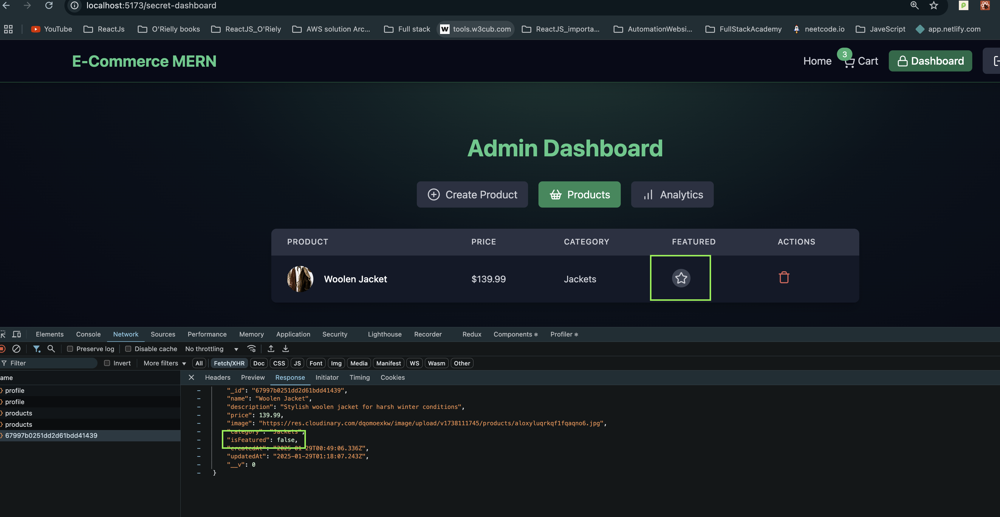
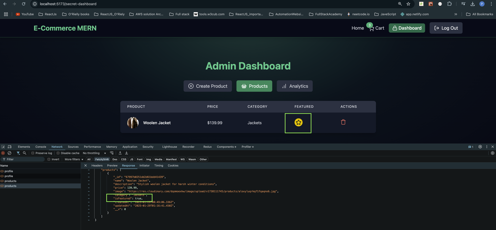
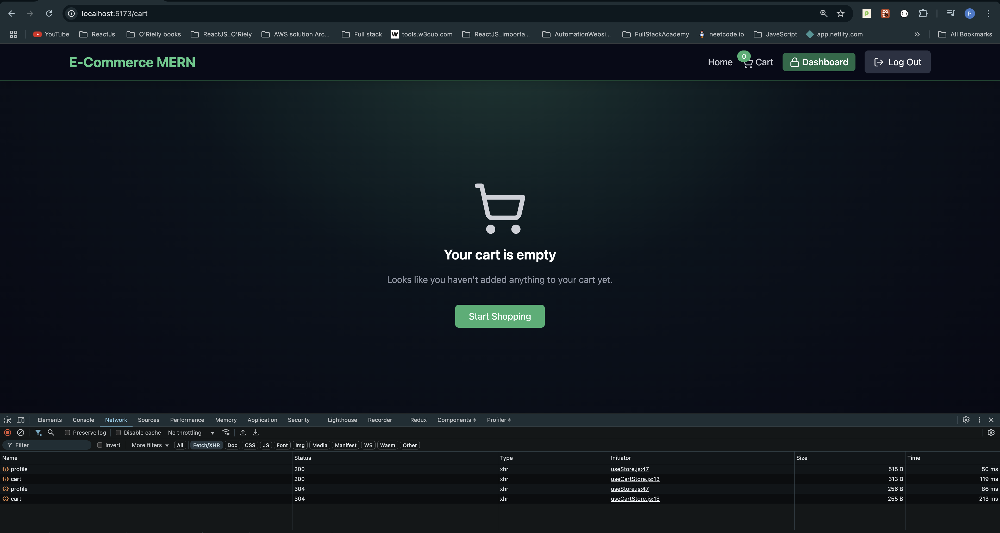
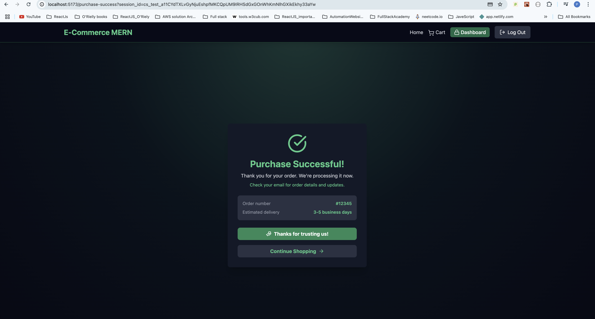
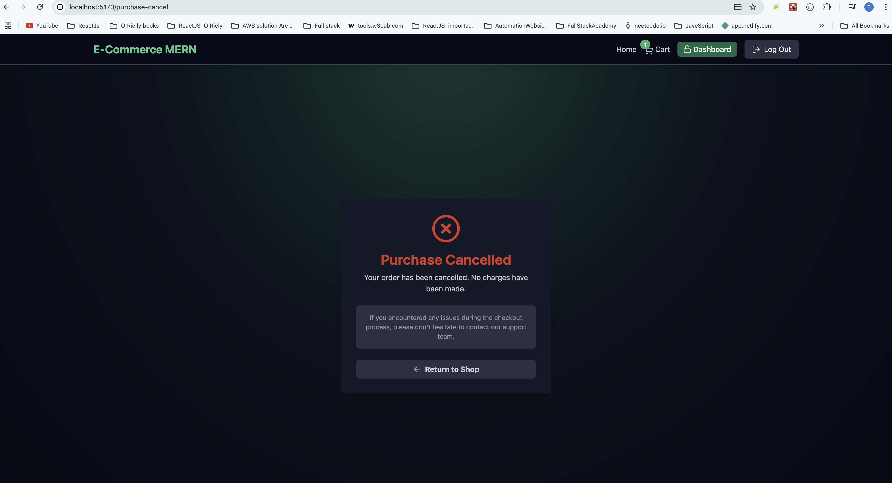
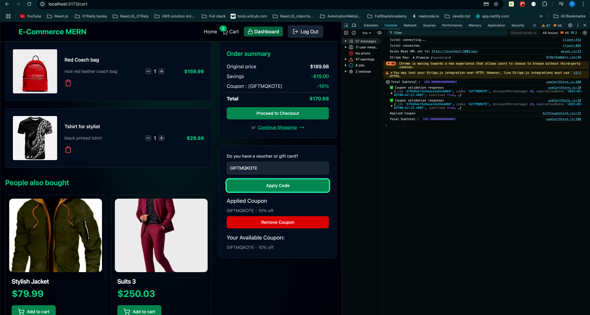
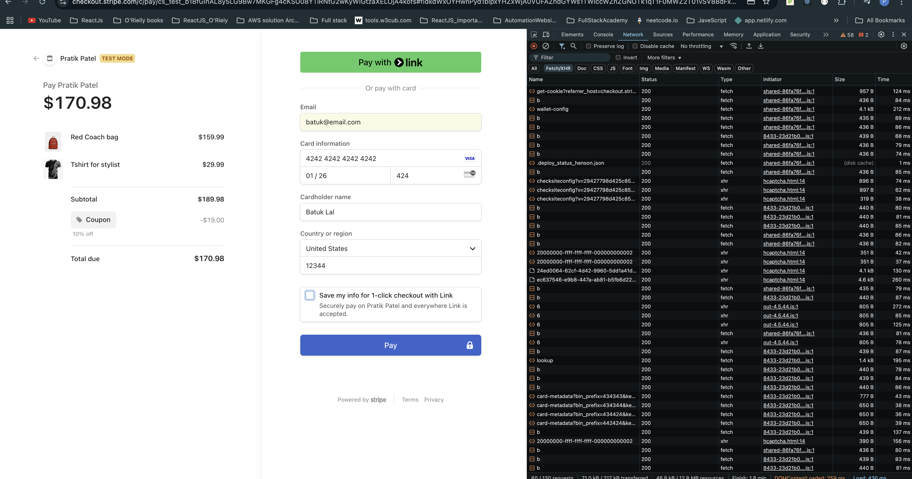
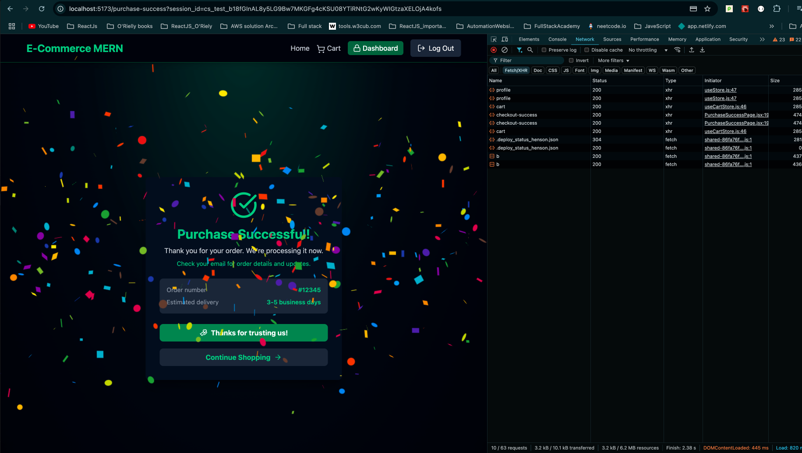
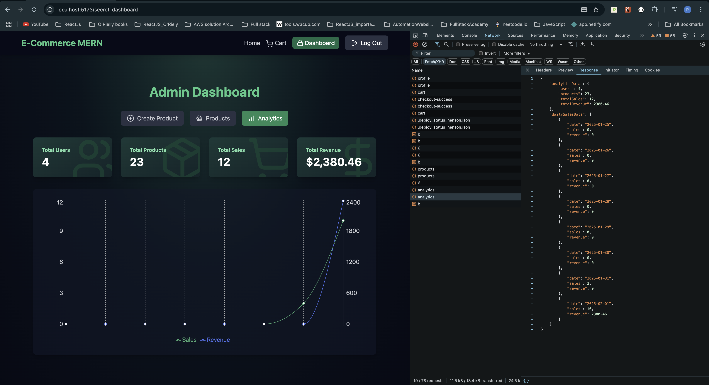

# E_Commerce_MERN_App


Live Application : https://e-commerce-mern-fullstack-app.onrender.com/

* upStash for redis :https://console.upstash.com/

* Stripe for payment : https://dashboard.stripe.com/test/dashboard

* 🚀 Project Setup
  
  🗄️ MongoDB & Redis Integration
  💳 Stripe Payment Setup
  🔐 Robust Authentication System
  🔑 JWT with Refresh/Access Tokens
  📝 User Signup & Login
  🛒 E-Commerce Core
  📦 Product & Category Management
  🛍️ Shopping Cart Functionality
  💰 Checkout with Stripe
  🏷️ Coupon Code System
  👑 Admin Dashboard
  📊 Sales Analytics
  🎨 Design with Tailwind
  🛒 Cart & Checkout Process
  🔒 Security
  🛡️ Data Protection
  🚀Caching with Redis

  
Setup .env file
```
PORT=5000
MONGO_URI=your_mongo_uri

UPSTASH_REDIS_URL=your_redis_url

ACCESS_TOKEN_SECRET=your_access_token_secret
REFRESH_TOKEN_SECRET=your_refresh_token_secret

CLOUDINARY_CLOUD_NAME=your_cloud_name
CLOUDINARY_API_KEY=your_api_key
CLOUDINARY_API_SECRET=your_api_secret

STRIPE_SECRET_KEY=your_stripe_secret_key
CLIENT_URL=http://localhost:5173
NODE_ENV=development
```
Run this app locally
```
npm run build

```
Start the app
```
npm run start
```

- accessToken and refreshToken using Jwt

-   Toggle option for featured Items

-  Home Page






- Empty Cart UI


- Success Payment Page


- Cancel Purchase Page


- Coupon Generated


- Stripe Payment


- Successful payment after discount subtraction


- Analytics for Sales

